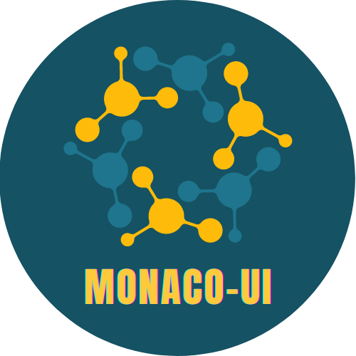

<p align="center">
  
</p>

<h1 align="center">Welcome to Monaco UI</h1>

<p align="center">
  <strong>The Monaco UI components library is an experimental project inspired by the styled system.</strong>
</p>

&nbsp;

Monaco UI is based on design principles. With a broad API and better developer friendliness, Developers may create customized component libraries, design systems, web apps, and more.

## Documentation

[https://shreelimbkar.github.io/monaco-ui/](https://shreelimbkar.github.io/monaco-ui/)

## Installing Monaco UI

This library is made up of a variety of components and utilities that you may add one at a time. Installing the monaco-ui package is all you need to do.

```
$ yarn add monaco-ui
# or
$ npm install --save monaco-ui
```

## Documentation

Check out our [documentation website](https://monaco-ui-docs.netlify.app/).

## Development environment

Clone the repo locally:

```
$ git clone https://github.com/shreelimbkar/monaco-ui.git
$ cd monaco-ui

# Install dependencies
$ yarn install

# Build all monorepo packages
$ yarn run build

# Bootstrap package - In the current repo, bootstrap the packages. Installing all their dependencies and linking any cross-dependencies.
$ yarn run bootstrap

# Start development server
$ yarn run start

```
